# Contexta

## Autonomous Context-Aware Threat Intelligence & Business Risk Platform

<p align="center">
  
  
  
  
  
</p>

---

## Table of Contents

- [Overview](#overview)
- [Architecture](#architecture)
- [System Workflow](#system-workflow)
- [Core Components](#core-components)
  - [Multi-Agent SOC System](#1-multi-agent-soc-system)
  - [BWVS Risk Scoring](#2-bwvs-risk-scoring-engine)
  - [Digital Twin Network](#3-digital-twin-network-simulation)
  - [Private Blockchain Ledger](#4-private-blockchain-ledger)
  - [CVE Feed Collector](#5-cve-feed-collector)
  - [Playbook Engine](#6-playbook-engine)
- [Data Flow Diagrams](#data-flow-diagrams)
- [Tech Stack](#tech-stack)
- [Getting Started](#getting-started)
- [API Reference](#api-reference)
- [Project Structure](#project-structure)

---

## Overview

**Contexta** is an enterprise-grade Security Operations Center (SOC) platform that combines AI-powered multi-agent analysis, custom risk scoring (BWVS), network topology simulation, and immutable audit logging to provide context-aware threat intelligence and business risk assessment.

### Key Capabilities

| Feature                 | Description                                                                 |
| ----------------------- | --------------------------------------------------------------------------- |
| **AI-Powered Analysis** | Multi-agent system with specialized roles for comprehensive threat analysis |
| **BWVS Scoring**        | Business-Weighted Vulnerability Scoring that considers operational context  |
| **Digital Twin**        | Network topology simulation for attack path analysis                        |
| **Blockchain Ledger**   | Immutable audit trail for compliance and forensics                          |
| **Automated Response**  | Playbook-driven incident response workflows                                 |
| **CVE Intelligence**    | Real-time vulnerability feed from CISA KEV and NVD                          |

---

## Architecture

### High-Level System Architecture

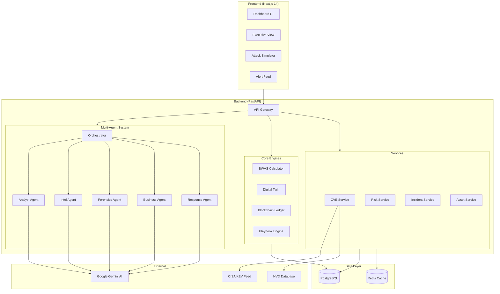

---

## System Workflow

### Complete Incident Analysis Pipeline

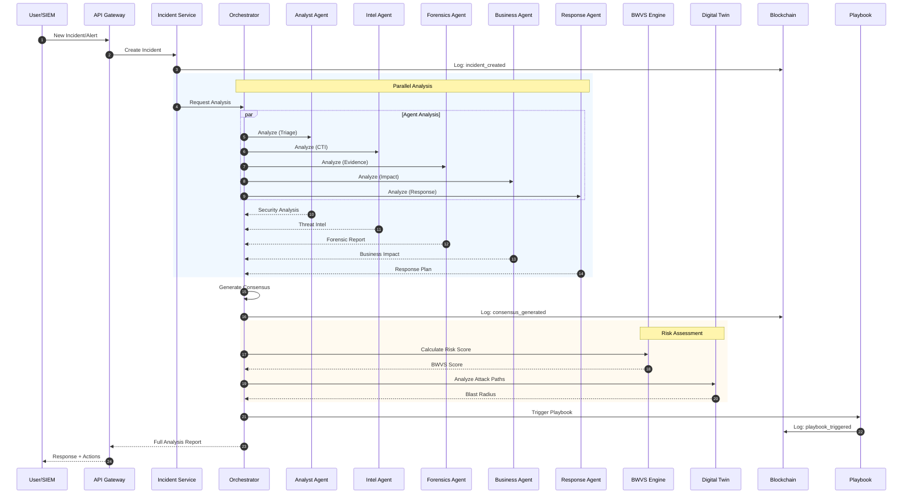

---

## Core Components

### 1. Multi-Agent SOC System

The heart of Contexta is a sophisticated multi-agent system powered by **Google Gemini AI**. Each agent specializes in a specific security domain.

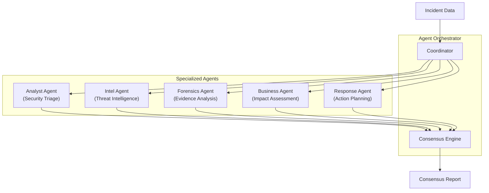

#### Agent Responsibilities

| Agent         | Role                              | Key Outputs                                |
| ------------- | --------------------------------- | ------------------------------------------ |
| **Analyst**   | Initial triage & classification   | Attack type, vector, severity              |
| **Intel**     | Threat intelligence & attribution | TTPs, threat actors, IOCs                  |
| **Forensics** | Evidence analysis                 | Timeline, artifacts, chain of custody      |
| **Business**  | Business impact assessment        | Financial impact, compliance, stakeholders |
| **Response**  | Response planning                 | Actions, playbooks, resources              |

#### Agent Analysis Flow

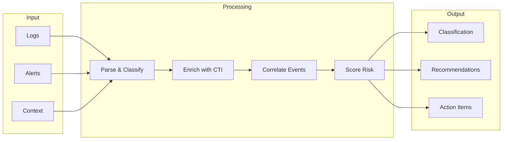

---

### 2. BWVS Risk Scoring Engine

**Business-Weighted Vulnerability Score (BWVS)** is a custom risk scoring methodology that enhances traditional CVSS by incorporating business context.

#### BWVS Formula

```
BWVS = (CVSS*0.20 + Exploit*0.20 + Exposure*0.15 + Asset_Crit*0.20 + Business_Impact*0.15 + AI_Relevance*0.10) * 10
```

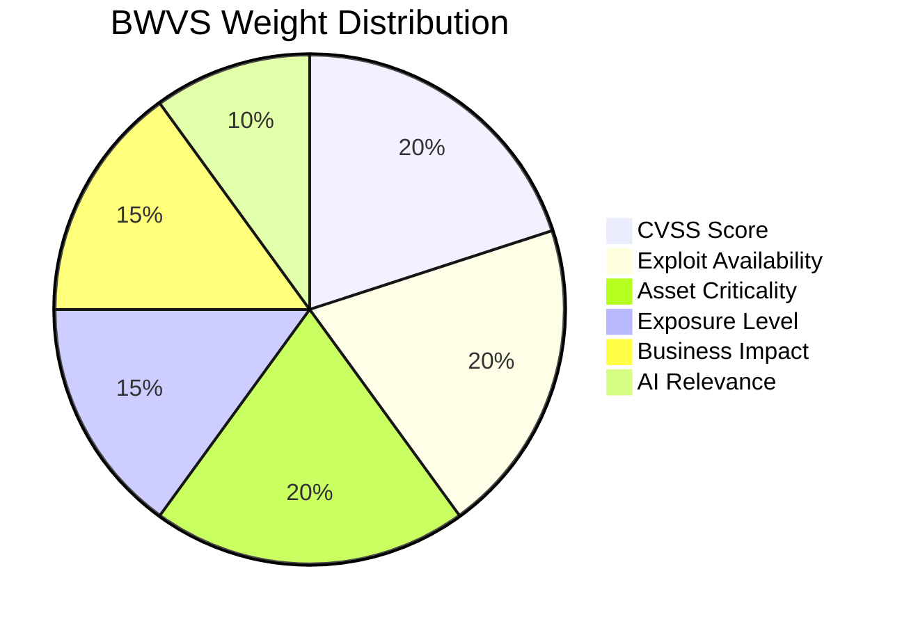

#### BWVS Calculation Flow

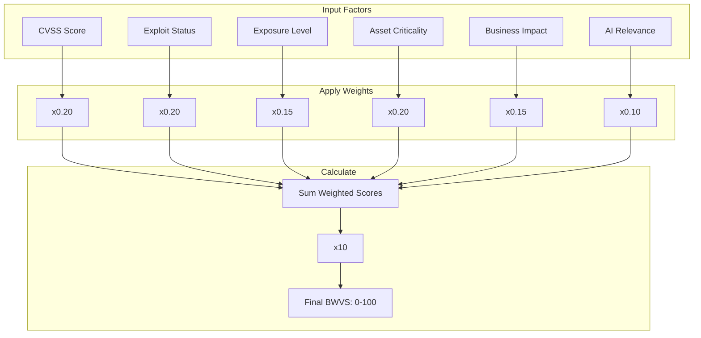

#### Priority Ranking Formula

For the Top-10 Risk Dashboard:

```
Priority = BWVS * Freshness * TrendFactor
```

| Factor          | Formula            | Description                               |
| --------------- | ------------------ | ----------------------------------------- |
| **Freshness**   | `0.5^(age_days/7)` | Exponential decay based on discovery time |
| **TrendFactor** | `1.0 - 2.0`        | Velocity of spread/exploitation           |

#### Risk Level Thresholds

| BWVS Range | Risk Level |
| ---------- | ---------- |
| 80-100     | Critical   |
| 60-79      | High       |
| 40-59      | Medium     |
| 0-39       | Low        |

---

### 3. Digital Twin Network Simulation

The **Digital Twin Engine** uses NetworkX to create a virtual representation of your network infrastructure for attack path analysis.

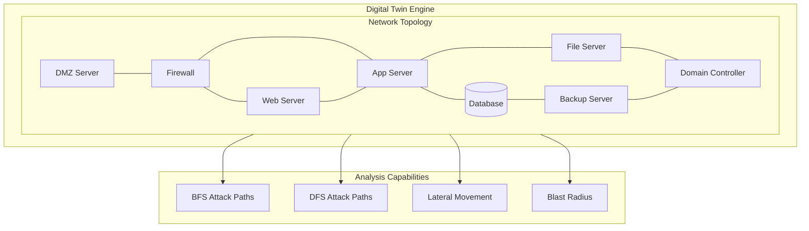

#### Attack Path Discovery

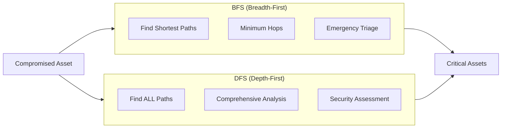

#### Lateral Movement Simulation

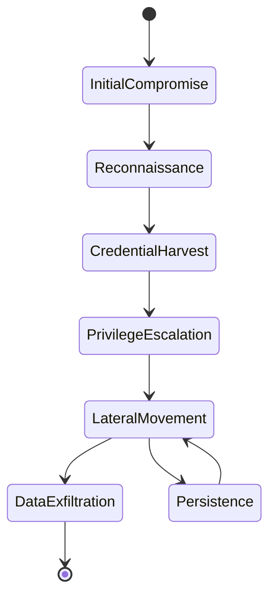

---

### 4. Private Blockchain Ledger

Immutable audit logging using a hash chain for complete traceability and tamper detection.

#### Hash Chain Structure

```
hash = SHA256(prev_hash + data)
```

```mermaid
graph LR
    subgraph Genesis["Block 0 (Genesis)"]
        G_H["hash: a1b2c3..."]
        G_P["prev: 0000..."]
        G_D["data: genesis"]
    end

    subgraph Block1["Block 1"]
        B1_H["hash: d4e5f6..."]
        B1_P["prev: a1b2c3..."]
        B1_D["event: incident_created"]
    end

    subgraph Block2["Block 2"]
        B2_H["hash: g7h8i9..."]
        B2_P["prev: d4e5f6..."]
        B2_D["event: analysis_complete"]
    end

    subgraph Block3["Block N"]
        B3_H["hash: j1k2l3..."]
        B3_P["prev: g7h8i9..."]
        B3_D["event: ..."]
    end

    Genesis --> Block1 --> Block2 --> Block3
```

#### Ledger Event Types

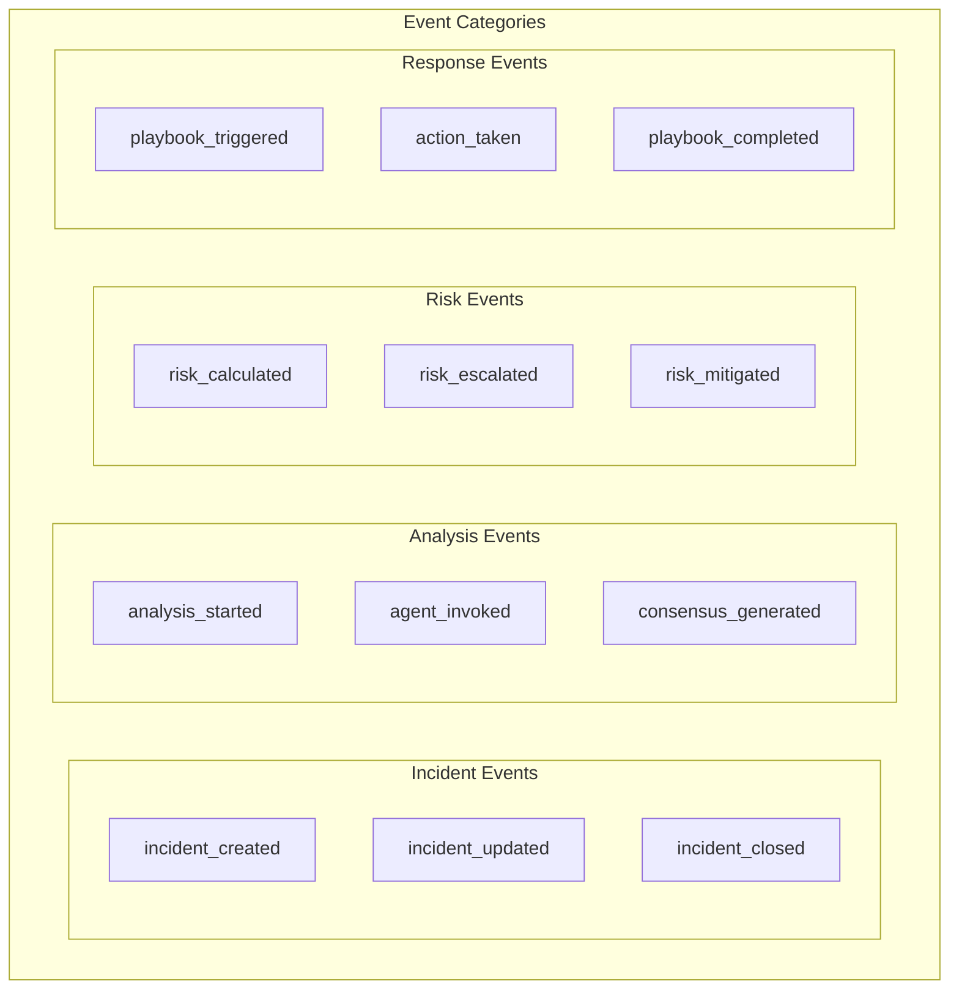

---

### 5. CVE Feed Collector

Real-time vulnerability intelligence from authoritative sources.

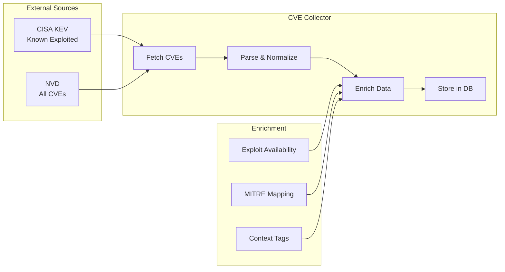

---

### 6. Playbook Engine

Automated response workflows with step-by-step execution.

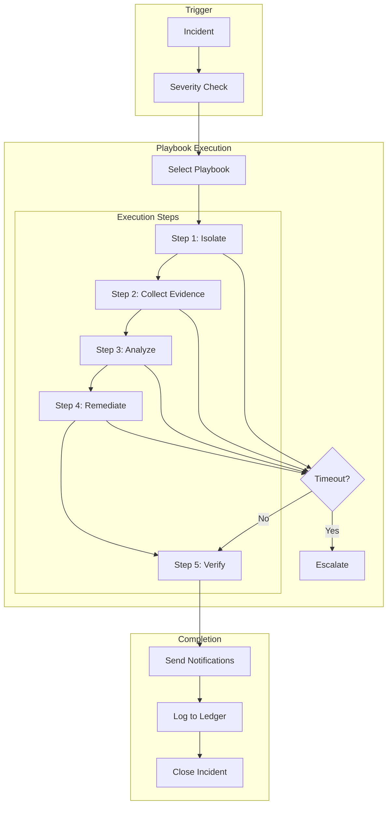

---

## Data Flow Diagrams

### Complete Data Flow

```mermaid
flowchart TB
    subgraph DataSources["Data Sources"]
        SIEM[SIEM Logs]
        CVE_FEED[CVE Feeds]
        ASSETS[Asset Inventory]
        USER_INPUT[User Input]
    end

    subgraph Processing["Processing Layer"]
        INGEST[Data Ingestion]
        NORMALIZE[Normalization]
        CORRELATE[Correlation Engine]
    end

    subgraph Analysis["Analysis Layer"]
        AGENTS[Multi-Agent Analysis]
        BWVS_CALC[BWVS Calculation]
        TWIN_SIM[Digital Twin Simulation]
    end

    subgraph Storage["Storage Layer"]
        PG[(PostgreSQL)]
        REDIS[(Redis)]
        LEDGER[(Blockchain)]
    end

    subgraph Output["Output Layer"]
        DASH[Dashboard]
        ALERTS[Alerts]
        REPORTS[Reports]
        API_OUT[API Response]
    end

    DataSources --> Processing --> Analysis
    Analysis --> Storage
    Storage --> Output

    INGEST --> PG
    CORRELATE --> REDIS
    AGENTS --> LEDGER
```

### Request/Response Flow

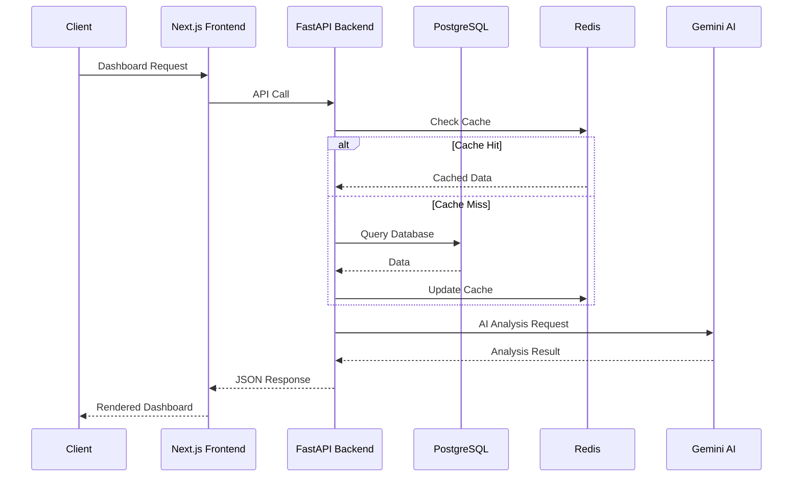

---

## Tech Stack

### Backend

| Technology         | Purpose                  |
| ------------------ | ------------------------ |
| **Python 3.11+**   | Core language            |
| **FastAPI**        | Async web framework      |
| **SQLAlchemy 2.0** | Async ORM                |
| **PostgreSQL**     | Primary database         |
| **Redis**          | Caching & rate limiting  |
| **Google Gemini**  | AI/LLM provider          |
| **NetworkX**       | Graph-based digital twin |
| **APScheduler**    | Background tasks         |
| **Docker**         | Containerization         |

### Frontend

| Technology       | Purpose            |
| ---------------- | ------------------ |
| **Next.js 14**   | React framework    |
| **TypeScript**   | Type safety        |
| **TailwindCSS**  | Styling            |
| **Recharts**     | Data visualization |
| **Lucide React** | Icons              |

---

## Getting Started

### Prerequisites

- Python 3.11+
- Node.js 18+
- PostgreSQL 15+
- Redis 7+
- Docker (optional)

### Quick Start

#### 1. Navigate to the Project Directory

```bash
cd contexta
```

#### 2. Backend Setup

```bash
cd source-code/backend

# Create virtual environment
python -m venv venv
source venv/bin/activate  # On Windows: venv\Scripts\activate

# Install dependencies
pip install -r requirements.txt

# Configure environment
cp .env.example .env
# Edit .env with your configuration

# Run database migrations
alembic upgrade head

# Start the server
uvicorn app.main:app --reload --port 8000
```

#### 3. Frontend Setup

```bash
cd source-code/frontend

# Install dependencies
npm install

# Start development server
npm run dev
```

#### 4. Access the Application

- **Frontend**: http://localhost:3000
- **Backend API**: http://localhost:8000
- **API Documentation**: http://localhost:8000/docs

### Docker Deployment

```bash
cd source-code/backend
docker-compose up -d
```

---

## API Reference

### Core Endpoints

| Method | Endpoint                         | Description           |
| ------ | -------------------------------- | --------------------- |
| `POST` | `/api/v1/incidents`              | Create new incident   |
| `GET`  | `/api/v1/incidents/{id}`         | Get incident details  |
| `POST` | `/api/v1/incidents/{id}/analyze` | Trigger full analysis |
| `GET`  | `/api/v1/risks/top10`            | Get top 10 risks      |
| `GET`  | `/api/v1/cves`                   | List CVEs             |
| `POST` | `/api/v1/twin/simulate`          | Run attack simulation |
| `GET`  | `/api/v1/ledger/chain`           | Get audit log         |
| `POST` | `/api/v1/playbooks/{id}/execute` | Execute playbook      |

### API Documentation

Full interactive API documentation available at:

- **Swagger UI**: `/docs`
- **ReDoc**: `/redoc`

---

## Project Structure

```
source-code/
├── backend/                    # FastAPI Backend
│   ├── app/
│   │   ├── agents/             # Multi-agent system
│   │   │   ├── orchestrator.py    # Agent coordinator
│   │   │   ├── analyst.py         # Security analyst agent
│   │   │   ├── intel.py           # Threat intel agent
│   │   │   ├── forensics.py       # Forensics agent
│   │   │   ├── business.py        # Business impact agent
│   │   │   └── response.py        # Response agent
│   │   ├── api/                # API routes
│   │   ├── ingestion/          # Data collectors
│   │   │   ├── cve_collector.py   # CVE feed collector
│   │   │   └── log_generator.py   # SIEM log generator
│   │   ├── ledger/             # Blockchain ledger
│   │   │   └── chain.py           # Hash chain implementation
│   │   ├── models/             # Database models
│   │   ├── risk_engine/        # Risk scoring
│   │   │   ├── bwvs.py            # BWVS calculator
│   │   │   └── ranking.py         # Priority ranking
│   │   ├── schemas/            # Pydantic schemas
│   │   ├── services/           # Business logic
│   │   ├── twin/               # Digital twin
│   │   │   └── engine.py          # NetworkX simulation
│   │   └── main.py                # Application entry point
│   ├── docs/                   # Documentation
│   ├── migrations/             # Alembic migrations
│   ├── playbooks/              # Response playbooks
│   └── tests/                  # Test suite
│
├── frontend/                   # Next.js Frontend
│   ├── app/                    # Next.js app router
│   ├── components/             # React components
│   │   ├── Dashboard.tsx          # Main dashboard
│   │   ├── AttackSimulator.tsx    # Attack simulation UI
│   │   ├── ExecutiveView.tsx      # Executive dashboard
│   │   └── dashboard/          # Dashboard widgets
│   └── contexts/               # React contexts
│
└── README.md                      # This file
```

---

## Additional Documentation

- [Agent System Documentation](source-code/backend/docs/AGENTS.md)
- [BWVS Scoring Methodology](source-code/backend/docs/BWVS.md)
- [Digital Twin Engine](source-code/backend/docs/DIGITAL_TWIN.md)
- [Blockchain Ledger](source-code/backend/docs/LEDGER.md)

---

## Security Considerations

- All API endpoints require authentication
- Role-based access control (RBAC)
- Immutable audit logging via blockchain
- Rate limiting via Redis
- Input validation and sanitization
- CORS configuration

---

## License

Proprietary - Contexta Platform

